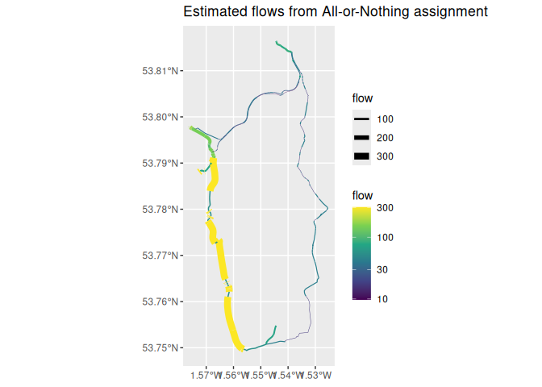

## The 4-stage model

A transport models from first principles can be expressed in 4 stages, according the classic four-step model:

1.  Trip generation
2.  Trip distribution
3.  Mode choice
4.  Route assignment

---

## The 4-stage model as a DAG

```{mermaid}
%%| label: fig-4stage
%%| fig-cap: The 4-stage transport modelling framework presented as a linear Directed Acyclic Graph (DAG)
graph TD
    A[Trip Generation] --> B[Trip Distribution]
    B --> C[Mode Choice]
    C --> D[Route Assignment]
```

---

## A more realistic model?

The dependency structure may be more realistic, with trip generation, distribution and mode choice all affected by the network.

```{mermaid}
%%| label: fig-6stage
%%| fig-cap: A 6-stage transport modelling framework with recursive dependencies between Trip Distribution and Route Assignment stages.
graph TD
    E[Network] --> D[Route Assignment: s4]
    F[Other Factors] --> C
    F --> B
    C --> D
    D --> B
    E --> B[Trip Distribution: s2]
    E --> C[Mode Choice: s3]
    B --> C
    B --> A[Trip Generation: s1]
```

---

## Why the 4-stage model?

-   Simplicity
-   Lack of data
-   Lack of methods
-   Epistemic bias

We should not throw the baby out with the bathwater, but reform, rebuild or *retrofit* transport modelling for the 21st Century.

---

## A model from first principles

Let's build a transport model, simplifying the 4-stage model by collapsing Trip Generation and Distribution into a single stage: **Trip Estimation**.

---

## Case study: Leeds, UK


---

## Inputs for a spatial interaction model

-   **Population**: Estimated from residential buildings in OSM.
-   **Jobs**: Estimated from commercial/retail/office buildings in OSM.


---

## A simple spatial interaction model

-   Inverse power distance decay function: `flow = pop * jobs * exp(beta * distance)`
-   Constrained on production (origin population).

. . .

Results:

::: {layout-ncol=2}


:::

---

## Distance decay


---

## Scenario analysis: "Go Dutch"

-   Model cycling uptake based on route distance and hilliness.
-   Uses the `pct` package.
-   `pcycle = pct::uptake_pct_godutch_2020(distance, gradient)`

---

## "Go Dutch" scenario results

Route network summarising the Go Dutch scenario, showing potential for cycling.


---

## Route assignment

-   Assign trips estimated by the SIM to the network.
-   'All or Nothing' (AON) assignment.



---

## Conclusions

-   It's possible to build transport models from scratch with open tools.
-   This approach is flexible, transparent, and reproducible.
-   Enables rapid scenario analysis (e.g., Go Dutch).
-   Future work: more sophisticated models, better data, integration with other tools like `dodgr`.

---

## Thanks!

-   Slides created with Quarto
-   Find out more: [robinlovelace.net](https://robinlovelace.net)
