## Introduction

"The role of [data analysis](https://sites.google.com/site/doingbayesiandataanalysis/) is to make people change their mind, based on the data." @kruschke_doing_2010

**The role of transport modelling is to make people change their mind, and investment decisions, based on evidence.**

"Those among us who are unwilling to expose their ideas to the hazard of refutation do not take part in the scientific game." @popper1934

**The more people who can run, modify, and see the outputs of transport models, the larger the impact**.

## What does change look like?

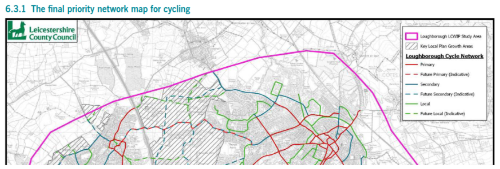

"Propensity to Cycle Tool helped us to assess the potential future demand for travel on these routes" (Leicestery County Council, [2023](https://www.leicestershire.gov.uk/sites/default/files/2023-11/Loughborough-Area-Local-Cycling-and-Walking-Infrastructure-Plan-Executive-Summary.pdf), one of [90+ local authority network plans using the tool](https://www.google.com/search?q=%22propensity+to+cycle+tool%22+lcwip+site%3Agov.uk)).

## Work in the Civil Service

<!-- {background-image="images/paste-9.jpeg" background-opacity="0.5" background-size="70%"} -->

::::: columns
::: {.column width="65%"}

:::

::: {.column width="35%"}
In 2024 I completed a 2 year contract in new agency Active Travel England (ATE), part of the UK Department for Transport (DfT).

My roles:

-   Recruit the team
-   Lead Data Scientist
-   Projects: plan.activetravelengland.gov.uk (formerly ATIP), SchoolRoutes
:::
:::::

Source: photo taken May 2023 at the Department for Transport's Data Science for Transport conference

------------------------------------------------------------------------

## Premises

1.  There are often trade-offs between level of detail and simplicity in transport models.
2.  Simplicity has advantages: transparency, reproducibility, flexibility, number of scenarios that can be run, and **explainability**.
3.  Results at the route segment level are the most useful output of transport models for many applications, including active travel planning.
4.  For models to be future-proof, they need to be easy for others to understand, reproduce, and extend.

::: notes
I'm going to start with some general observations about the role of transport planning and what we're trying to achieve, before going into a case study of building a transport model from first principles using open tools.

1.  There is no one-size-fits-all transport model. Different contexts require different models.
:::

## The 4-stage model

A transport models from first principles can be expressed in 4 stages, according the classic four-step model:

1.  Trip generation
2.  Trip distribution
3.  Mode choice
4.  Route assignment

------------------------------------------------------------------------

## The 4-stage model as a DAG

```{mermaid}
%%| label: fig-4stage
%%| fig-cap: The 4-stage transport modelling framework presented as a linear Directed Acyclic Graph (DAG)
graph TD
    A[Trip Generation] --> B[Trip Distribution]
    B --> C[Mode Choice]
    C --> D[Route Assignment]
```

------------------------------------------------------------------------

## A more realistic model?

The dependency structure may be more realistic, with trip generation, distribution and mode choice all affected by the network.

```{mermaid}
%%| label: fig-6stage
%%| fig-cap: A 6-stage transport modelling framework with recursive dependencies between Trip Distribution and Route Assignment stages.
graph TD
    E[Network] --> D[Route Assignment: s4]
    F[Other Factors] --> C
    F --> B
    C --> D
    D --> B
    E --> B[Trip Distribution: s2]
    E --> C[Mode Choice: s3]
    B --> C
    B --> A[Trip Generation: s1]
```

------------------------------------------------------------------------

## Why the 4-stage model?

-   Simplicity
-   Lack of data
-   Lack of methods
-   Epistemic bias

We should not throw the baby out with the bathwater, but reform, rebuild or *retrofit* transport modelling for the 21st Century.

So let's see what we can do with the 4-stage model before moving on to more complex models.

------------------------------------------------------------------------

<!-- ## The four-stage model in context -->

::::: columns
::: {.column width="70%"}
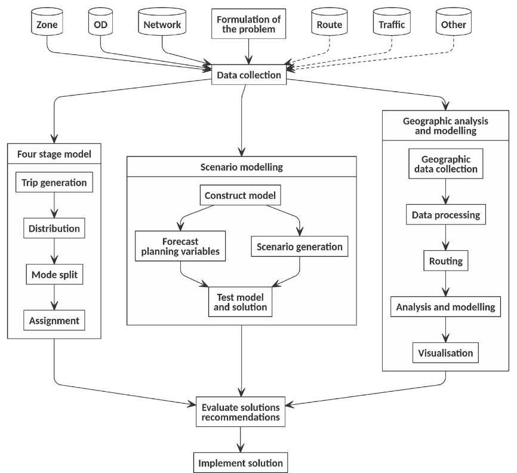
:::

::: {.column width="30%"}
Schematic diagram illustrating the modelling process, geographic analysis and the four-stage model in the context of the wider transport planning process @lovelace2021, building on @ortuzars._modelling_2011.
:::
:::::

## Aggregate models for DRT


Aggregate analysis used to inform DRT zone selection [@mahfouz2025]

## Activity-based models

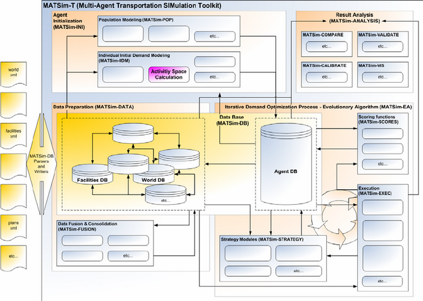

A schematic of a research project involving MATSim @rai2007

## Efficient mesoscopic transport model (uxSIM)


\~60k vehicles passing through a 10km x 10km grid network in 2 hours (30 s on consumer-grade computer) [@seo2025]

## Deep learning approaches

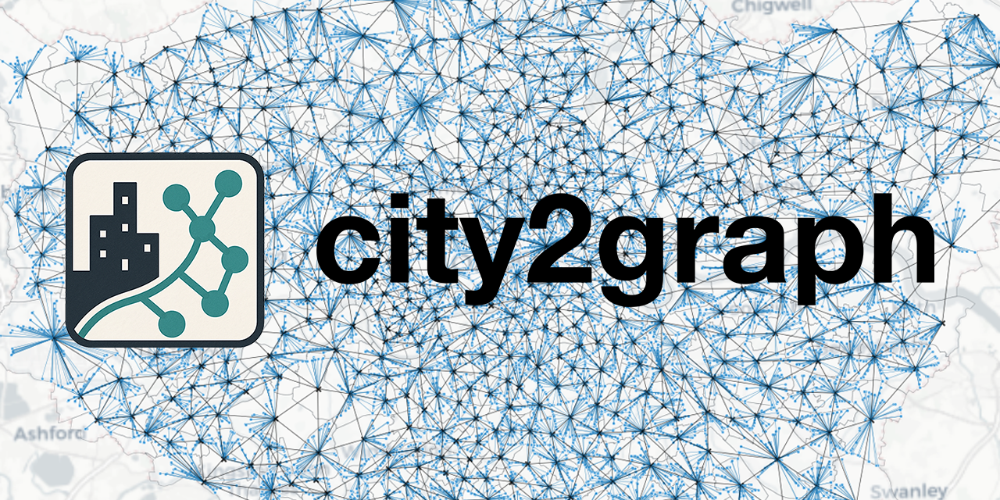

Source: the [citygraph](https://github.com/c2g-dev/city2graph) GitHub repo

## A model from first principles

Let's build a transport model, simplifying the 4-stage model by collapsing Trip Generation and Distribution into a single stage: **Trip Estimation**.

```{mermaid}
%%| label: fig-3stage
%%| fig-cap: A simplified 3-stage transport modelling framework.
graph TD
    A[Trip Estimation] --> B[Mode Choice]
    B --> C[Route Assignment]
    C --> B
    C -.-> A
```

------------------------------------------------------------------------

## Case study: Leeds, UK

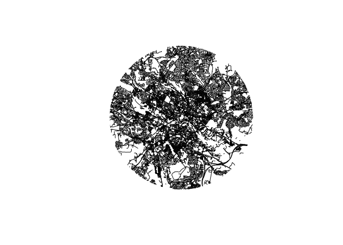

------------------------------------------------------------------------

## Inputs for a spatial interaction model

-   **Population**: Estimated from residential buildings in OSM.
-   **Jobs**: Estimated from commercial/retail/office buildings in OSM.

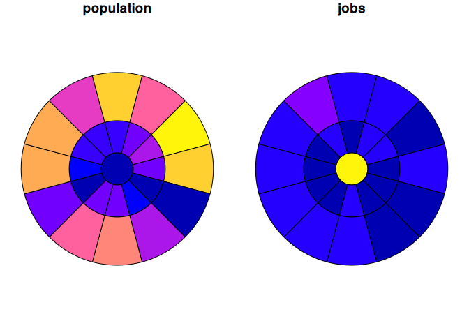

------------------------------------------------------------------------

## A simple spatial interaction model

You can run SIMs with a few lines of code with the {simodels} R package and the `spint` Python package, for example.

Results of a simple production-constrained model with all OD pairs (left) and top 20 trips only (right):

::: {layout-ncol="2"}
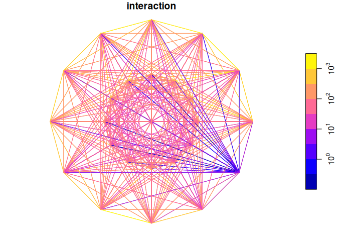

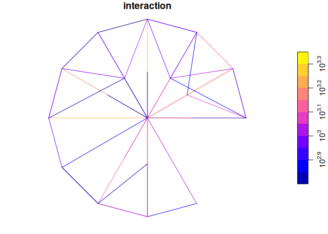
:::

------------------------------------------------------------------------

## Distance decay

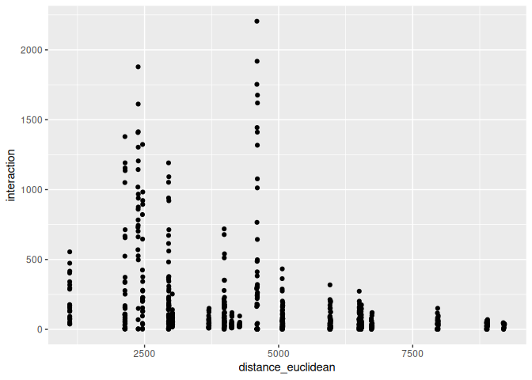

------------------------------------------------------------------------

## Scenario analysis: "Go Dutch"

-   Model cycling uptake based on route distance and hilliness.
-   Uses the `pct` package.
-   `pcycle = pct::uptake_pct_godutch_2020(distance, gradient)`

------------------------------------------------------------------------

## "Go Dutch" scenario results

Route network summarising the Go Dutch scenario, showing potential for cycling.

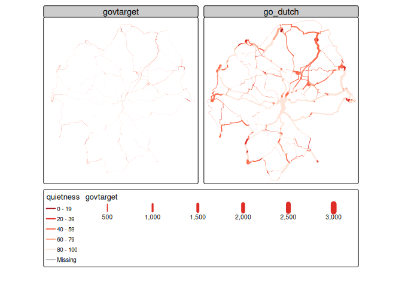

------------------------------------------------------------------------

## Application to Zurich, Switzerland

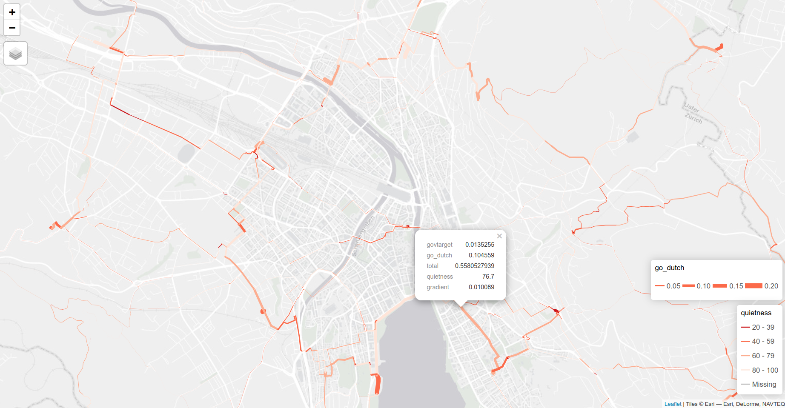

Open access and [interactive](https://github.com/Robinlovelace/zurich25/releases/download/v1/zurich-route-network.html) results of the '3-stage model' applied to Zurich using less than 100 lines of reproducible code hosted at [github.com/robinlovelace/zurich25](https://github.com/robinlovelace/zurich25).

------------------------------------------------------------------------

## Conclusions and next steps

-   Logical next step: try different implementations and inputs to benchmark performance and improve the '3-stage model'.
-   Not all transport planning research questions or applications require the same tools.
-   A 'horses for courses' approach suggests thinking about what change looks like, and to choose/build tools accordingly.
-   The 3-stage model presented is an example of what simple, open, efficient tools can look like, but is it future-proof?
-   Enables rapid scenario analysis (e.g., Go Dutch).
-   Future work: validation, optimisation, and applying the approach to other contexts and modes.

------------------------------------------------------------------------

## Thanks + references

-   Find out more: [www.robinlovelace.net](https://www.robinlovelace.net)